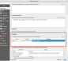

################
Build the plugin
################

.. important:: Make sure, where is the PyQt5 resource compiler
    (``pyrcc5``) available in your :envvar:`PATH`

    You can test it by running
        
    .. code-block:: bash

        pyrcc5 --help

    You should obtain readable help message

.. figure:: images/pyrcc5-help.png

.. note:: If you are on MS Windows, open *OSGeo4W Shell* (ideally as
   *administrator*) and run two scripts before any attempts:
   ``py3_env`` and ``qt5_env``

        .. code-block:: bash

                c:\> py3_env

                c:\> qt5_env

                c:\> pyrcc5 --help

        .. figure:: images/pyrcc5-windows.png

To build the plugin :program:`pb_tool` must be available in the system. This
package is available via PyPI service (using ``pip install``).

.. note:: It might look as good idea to use standard ``make``, since
   Makefile is available too. This is considered deprecated option and
   should no longer be used. ``pb_tool`` is more complex build system
   (and supports various operating systems).

To install ``pb_tool``, just use

.. code-block:: bash

        python3 -m pip install pb_tool

**************************************
Configuration file :file:`pb_tool.cfg`
**************************************

:program:`pb_tool` needs a configuration file (generated by the :doc:`Plugin
Builder <start_plugin>`). In this file, you can modify target plugin
path as well as locales, extra directories needed and other metadata.

*************************
First build of the plugin
*************************

First we compile UI files

.. code-block:: bash

        pb_tool compile

..         
 Next we deploy our plugin to the QGIS Plugin directory

 .. code-block:: bash

         pb_tool deploy

         Deploying to /home/jachym/.local/share/QGIS/QGIS3/profiles/default/python/plugins/save_views
         Deploying will:
                 * Remove your currently deployed version
                 * Compile the ui and resource files
                 * Build the help docs
                 * Copy everything to your
                   /home/jachym/.local/share/QGIS/QGIS3/profiles/default/python/plugins/save_views
                   directory

         Proceed? [y/N]: y

 .. note:: It seems, that ``pb_tool`` does require 7zip compression, which is not
         available in OSGeo4W project - therefore the QGIS Plugin can not be
         zipped. You will have to install it manually.

*********************
Using plugin in place
*********************

Instead of deploying the plugin using :program:`pb_tool` it is more
flexible when the plugin to set up by QGIS environment in order to be
able to install the plugin from current folder without need of
deployment.

Let's add your plugin location to the :envvar:`QGIS_PLUGINPATH` in
:menuselection:`Settings --> Options --> System`. Enable ``Use custom
variables`` in ``Environment`` section and add a new variable:
:envvar:`QGIS_PLUGINPATH`. This variable should point to a **parent**
directory where the plugin is located. *Restart* (close and open) QGIS
and continue with :ref:`installing the plugin <install>`.

   
   Setting of the ``QGIS_PLUGINPATH`` variable.

.. _install:

***********************
Activate plugin in QGIS
***********************

Open QGIS and find the new plugin in the :menuselection:`Plugins -->
Manage and Install Plugins...`. Check the checkbox to activate the
plugin in QGIS.

.. figure:: images/save-views-enable.png

   Activate plugin Save Views.

An icon of the plugin |new_plugin| appears in the toolbar as well as
new menu selection in :menuselection:`Vector --> Save Views --> Save Views`.

When running it, a new (empty) dialog will be open.

.. _plugin-dlg:

*****
Notes
*****

Virtualenv
^^^^^^^^^^

Virtualenv is one of the possibilities, how to keep your code and it's
dependencies independent.

To create the virtualenv, run 

.. code-block:: bash

        python3 -m venv myvenv

For QGIS running within Python `virtualenv`, you need to adjust
:file:``activate` script and add :envvar:`PYTHONPATH` with Python, Qt
and QGIS libraries.

.. code-block:: bash

        $EDITOR myvenv/bin/activate

        [...]
        export PYTHONPATH=$PYTHONPATH:/usr/local/share/qgis/python/:/usr/lib/python3/dist-packages/
        [...]

To initialize the virtualenv, run

.. code-block:: bash

        source myenv/bin/activate

.. note:: It's generally good advice to use :program:`virtualenvwrapper` tool.
