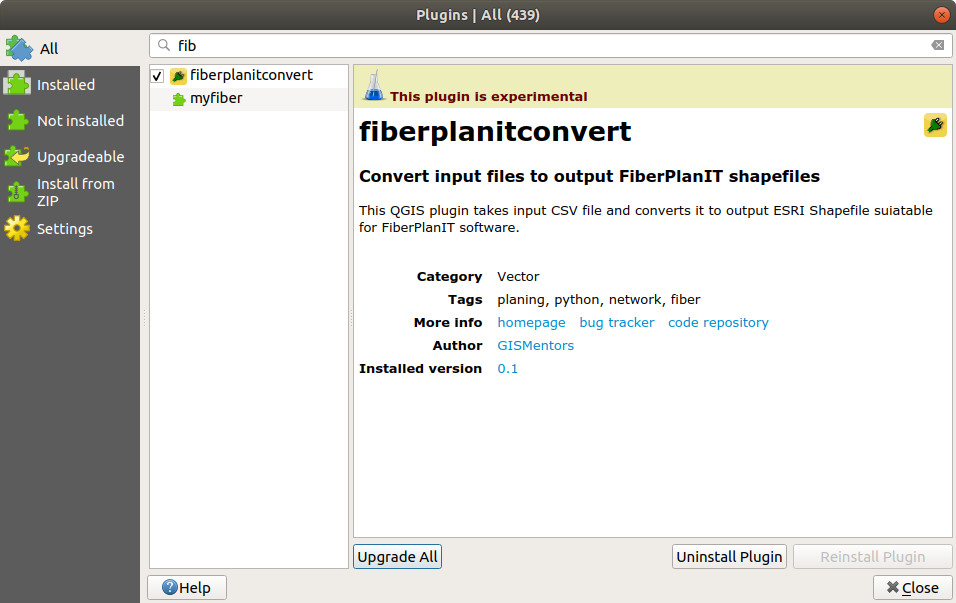

################
Build the plugin
################

To build the plugin ``pb_tool`` must be available in the system. This
package is available via PyPI service (using ``pip install``).

.. note:: It might look as good idea to use standard ``make``, since
   Makefile is available too. This is considered deprecated option and
   should no longer be used. ``pb_tool`` is more complex build system
   (and supports various opereting systems).

To install ``pb_tool``, just use

.. code-block:: bash

        pip install pb_tool

**************************************
Configuration file :file:`pb_tool.cfg`
**************************************

``pb_tool`` needs a configuration file (generated by the :doc:`Plugin
Builder <start_plugin>`). In this file, you can modify target plugin
path as well as locales, extra directories needed and other metadata.

*************************
First build of the plugin
*************************

First we compile UI files

.. code-block:: bash

        pb_tool compile

Next we deploy our plugin to the QGIS Plugin directory

.. code-block:: bash

        pb_tool deploy

        Deploying to ~/.local/share/QGIS/QGIS3/profiles/default/python/plugins/fiberplanitconvert
        Deploying will:
          * Remove your currently deployed version
          * Compile the ui and resource files
          * Build the help docs
          * Copy everything to your ~/.local/share/QGIS/QGIS3/profiles/default/python/plugins/fiberplanitconvert directory
                        
        Proceed? [y/N]: y

.. tip:: Instead of deploying the plugin using ``pb_tool`` it could be
   more flexible when developing the plugin to set up QGIS environment
   in order to be able to install the plugin from original destination
   without need of deployment.

   This can be done by setting up environmental variable
   :envvar:`QGIS_PLUGINPATH` in :menuselection:`Settings --> Options
   --> System`. Enable ``Use custom variables`` in ``Environment``
   section and add a new variable: :envvar:`QGIS_PLUGINPATH`. This
   variable should point to a root directory where the directory with
   the plugin is located. *Restart* (close and open) QGIS and continue
   with :ref:`installing the plugin <install>`.
	 
.. _install:

*************************
Installing plugin to QGIS
*************************

Open QGIS and find the new plugin in the :menuselection:`Plugins -->
Manage and Install Plugins...`. Check the checkbox to activate the
plugin in QGIS.

        Activate newly created plugin in QGIS

An icon of the plugin |new_plugin| appears in the toolbar as well as
new menu selection in :menuselection:`Vector --> fibarplanitconvert
--> CSV2FiberplanIT`.

When running it, new (empty) dialog will be open.

.. figure:: images/plugin_running1.png

   Empty plugin dialog of the plugin.

*****
Notes
*****

Virtualenv
^^^^^^^^^^

Virtualenv is one of the possibilities, how to keep your code and it's
dependencies independent.

To create the virtualenv, run 

.. code-block:: bash

        python3 -m venv yungovenv

For QGIS running within Python `virtualenv`, you need to adjust
:file:``activate` script and add :envvar:`PYTHONPATH` with Python, Qt
and QGIS libraries.

.. code-block:: bash

        $EDITOR yungovenv/bin/activate

        [...]
        export PYTHONPATH=$PYTHONPATH:/usr/local/share/qgis/python/:/usr/lib/python3/dist-packages/
        [...]

To initialize the virtualenv, run

.. code-block:: bash

        source yungovenv/bin/activate

.. note:: It's generaly good advice to use ``virtualenvwrapper`` tool.
