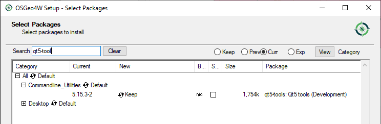
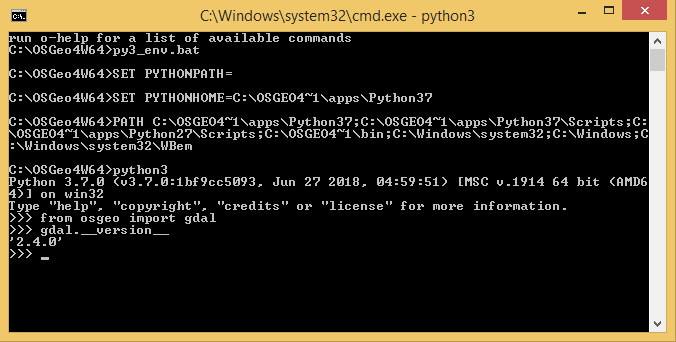

############################
Installation and environment
############################

For every development, some system tweaks and necessary tools are needed. 

.. todo:: This section requires more work

***********
Text Editor
***********
You can use any text editor, you are already using for your daily programming
activities. If you are in doubt, which one to choose, consider one of following
editors:

* `Sublime <https://www.sublimetext.com/>`_ A sophisticated text editor for code, markup and prose
* `Atom <https://atom.io/>`_ A hackable text editor for the 21st Century
* `VisualStudio Code <https://code.visualstudio.com/>`_ Visual Studio Code is a lightweight but powerful source code editor which runs on your desktop and is available for Windows, macOS and Linux.
* `PyCharm <https://www.jetbrains.com/pycharm/>`_ The Python IDE for Professional Developers 

Sublime and Atom are rather simplier editors (with complex features in the
backend though), while VisualStudio and PyCharm are more Integrated development
environemnt. 

It is worth to spend some time with some tutorial of your featured editor to
know all the features and hidden gems, to become more effective.

***********
Qt Designer
***********
`Qt Designer <https://www.qt.io/design>`_ is tool for creating destkop
applications, which will be later  empowered with some programming code to make
the graphical user interface work.

Usually, the application design is created by the programmer, but it does no
need to be the case, since one does not have to know any programming in order to
create user interface. You just have to understand principals of the UX design -
therefore the look and feel of the application can be done by someone else as
well as the final programming code, which will bring the apparence of the
application to life.

Install Qt Designer on Linux
============================

On Linux, you should be able to use your favourite packaging tool, like
``apt-get``

.. code-block:: bash

        sudo apt-get install python3-pyqt5 libqt5designer5 python3-pyqt5
        
Install Qt Designer on Windows
==============================

On the Windows platform, start the OSGeo4W installator, choose ``Advanced
installation`` and search for the ``qt5-tools`` package.

Then you have to start the OSGeo4W shell and then you have to run the :file:`py3_env.bat` script, which will set all
necessary environment variables.

.. code-block:: bash

        c:\> c:\OSGeo4W64\bin\py3_env.bat

Qt Designer can be found in the start menu of Windows.

.. code-block:: bash

        c:\> c:\OSGeo4W64\bin\py3_env.bat
