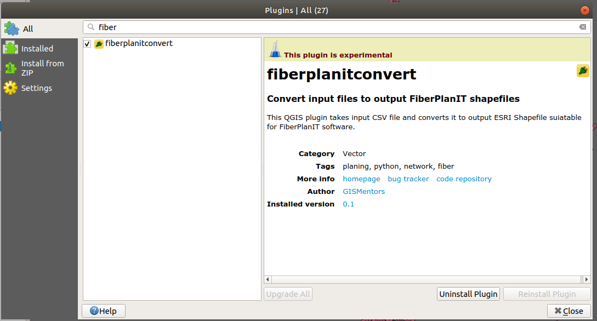
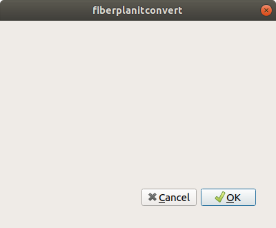
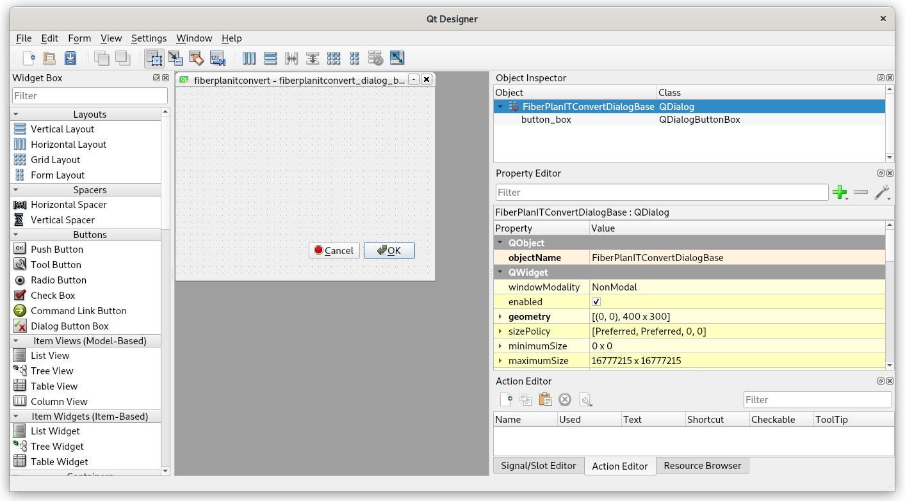

*********************
Plugin initialization
*********************

=================
Load input layers
=================

Use :menuselection:`Layer --> Add layer --> Add vector layer`, icon
|mActionAddOgrLayer| :sup:`Add vector layer` or :kbd:`Ctrl+Shift+V`.

1. Load (Shapefile) :file:`Trench Pattern EET-01.shp`
2. Load :file:`CO EET-01.shp`
3. Load CSV file :file:`CIF-A-57-2019-04-19-12.csv`, choose X, Y
   columns and :epsg:`28992` as coordinate reference system

===============
Activate plugin
===============

In :menuselection:`Plugins --> Manage and install plugins` search and
activate the `fiberconvert` plugin.

   Activate the plugin.

See a new icon in the toolbar |new_plugin1|. Plugin can be launched.

   Empty plugin dialogue.

===========
Qt Designer
===========

Start the `Qt Desginer tool <https://doc.qt.io/qt-5/qtdesigner-manual.html>`_
and open the :file:`fiberplanitconvert_dialog_base.ui` file.

	   
      The dialogue is empty so far.

========
The code
========

The key file is :file:`fiberplanitconvert.py` and the ``run()`` method:

.. literalinclude:: ../src/fiberplanitconvert-01-init/fiberplanitconvert.py
        :lines: 188-205

.. note:: The code can be downloaded from
          https://github.com/GISMentors/yungo-plugins/tree/master/src/fiberplanitconvert-01-init

		
