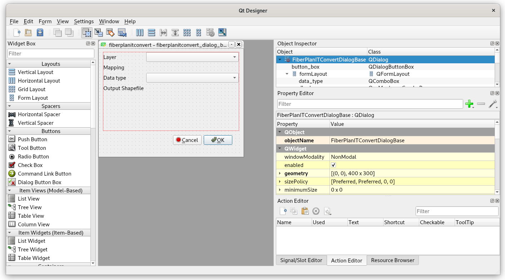

**************************
Working with vector layers
**************************

.. note:: The code can be downloaded from
          https://github.com/GISMentors/yungo-plugins/tree/master/src/fiberplanitconvert-02-qgis-memorylayer

:pyqgis:`QgsVectorLayer` represents a vector layer registered in
QGIS. In our case, both input and output are vector layers (files).

Several drivers for writing the vector data can be used, among others
`postgres`, `ogr` (from `GDAL library <http://gdal.org>`__) and `memory`.

A new layer can be easily defined by :pyqgis:`QgsDataSourceUri`, which
can contain the whole definition of a new layer, including:

* geometry type
* attribute names and type
* coordinate reference system definition

Example of new vector layer definition by :pyqgis:`QgsDataSourceUri`::

    Point?crs=epsg:4326&field=id:integer&field=name:string(20)&index=yes

The layer can be also defined in more-programatic way, using
:pyqgis:`QgsVectorDataProvider`. Attributes can be defined using
:pyqgis:`QgsField` definition with type specified as :qt5:`qvariant`
data types, for example:

.. literalinclude:: ../src/fiberplanitconvert-02-qgis-memorylayer/fiberplan/__init__.py
    :lines: 57-71

===========
Qt Designer
===========

For now, we need 3 user inputs:

* Input vector layer
* Mapping file
* Target data type

.. task:: In the Qt Designer create 3 required inputs. Use
    :pyqgis:`MapLayerComboBox` for layer selection, :pyqgis:`QgsFileWidget` for
    mapping file definition and output Shapefile name and :pyqt:`QComboBox` for
    data type definition.

    Use `objectName` attribute to name the objects: `dlg_layers`, `mapping`,
    `data_type`, `file_output`.

    Consider using Horizontal and Vertical layouts. 

    The dialogue with filled attributes.

========
The Code
========

The ``run()`` method of the :py:class:`FiberPlanITConvert` class
has to do following tasks:

#. Initialize some initial form inputs
#. Get the user input data
#. Call the converting function

.. literalinclude:: ../src/fiberplanitconvert-02-qgis-memorylayer/fiberplanitconvert.py
        :lines: 201-224

GUI Initialization
------------------

A new function ``_set_dialogs()`` is introduced in order to set input
forms widgets.

.. literalinclude:: ../src/fiberplanitconvert-02-qgis-memorylayer/fiberplanitconvert.py
        :lines: 180-189

Getting user input data
-----------------------

When the user press the :item:`OK` button, the ``run()`` method
continues. Filled data inputs from named form elements are detected.

.. literalinclude:: ../src/fiberplanitconvert-02-qgis-memorylayer/fiberplanitconvert.py
        :lines: 217-221

The convert function
--------------------
The main function obtains all necessary arguments:

* `input_layer` object of :pyqgis:`QgsVectorLayer`
* `mapping_file` file name
* `target_data_type` name

.. literalinclude:: ../src/fiberplanitconvert-02-qgis-memorylayer/fiberplan/__init__.py
   :lines: 33-42

Creating new layer - the complex way
------------------------------------
New layer can be either specified with help of the :pyqgis:`QgsDatasourceUri`
url text string or using ``addAttributes()`` method of the
:pyqgis:`QgsVectorDataProvider`.

.. literalinclude:: ../src/fiberplanitconvert-02-qgis-memorylayer/fiberplan/__init__.py
        :lines: 57-71

Writing new features to the layer
---------------------------------

In order to create new vector feature, we need to create a new
:pyqgis:`QgsFeature` instance.

Then, we can use the ``setGeometry()`` and ``setFields()`` methods. The attributes (or
"fields") are obtained from the input layer.

.. literalinclude:: ../src/fiberplanitconvert-02-qgis-memorylayer/fiberplan/__init__.py
        :lines: 46-55
