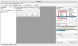
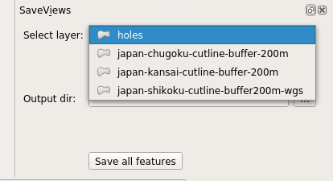

***********
Creating UI
***********

For now, we need two user inputs:

* Input vector layer
* Output target directory

.. task:: In the Qt Designer create two required inputs. Use
    :pyqgis:`QgsMapLayerComboBox` for layer selection, :pyqgis:`QgsFileWidget` for
    output dir name.

    Use ``objectName`` attribute to name the objects: `layers`,
    `output_dir` and `submit`.

    Consider using grid layout and horizontal/vertical spacers.

   Example of plugin UI design.

========
The Code
========

The ``run()`` method of the :py:class:`SaveViews` class
has to do following tasks:

#. Initialize some initial form inputs
#. Get the user input data
#. Call the saving function

.. literalinclude:: ../src/save_views02/save_views.py
        :lines: 217-242
        :linenos:
        :emphasize-lines: 16,17,18

Note, that we had to import QGIS Python modules

.. literalinclude:: ../src/save_views02/save_views.py
        :linenos:
        :lines: 29-32

Image save function
-------------------

Finally, we approach to the heart of the plugin: the ``save_views()`` method.

.. literalinclude:: ../src/save_views02/save_views.py
        :linenos:
        :lines: 244-276

    Final plugin usage *Save Views*.

.. task:: Make sure that the plugin will not fail, if no target
          directory is selected.

.. hint:: In case that you want to change plugin icon, modify the
    :file:`icon.png` file as you wish.

.. _np-plugin-result:

.. figure:: ../images/save-views-result.png
   :class: large

   Example of image files stored in output directory.
