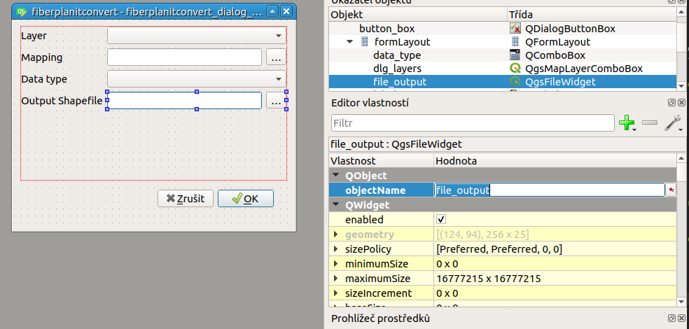

****************
Shapefile output
****************

.. note:: The code can be downloaded from https://github.com/GISMentors/yungo-plugins/tree/master/src/fiberplanitconvert-03-qgis-shp

ESRI Shapefile is one of the most common (file-based) GIS formats.

For writing the data into Esri Shapefile, there are 2 possible options:

===============================
Creating Shapefile from scratch
===============================

The :pyqgis:`QgsVectorFileWriter` class enables to create a new file-based layer.

.. literalinclude:: ../src/qgis-vector-layer.py

The idea of the code is to approach step-by-step

1. A set of attributes is defined by :pyqgis:`QgsFields` and :pyqgis:`QgsField`
   classes
2. New file with geometry, attributes and other metadata is created
3. The file is loaded to QGIS project using the `ogr` driver
4. New vector feature :pyqgis:`QgsFeature` is created and attribute fields are
   set
5. Geometry is read from the WKT format, attributes are assigned directly
6. Feature is added to the layer

====================================
Creating Shapefile from memory layer
====================================

QGIS has possibility to copy features from one layer to another one using
`writeAsVectorFormat` method of the :pyqgis:`QgsVectorFileWriter` class

.. literalinclude:: ../src/fiberplanitconvert-03-qgis-shp/fiberplan/__init__.py
    :lines: 47, 48

===========
Qt Designer
===========

We need to define 4th user input: name for the new to-be-created Shapefile

.. task:: In the Qt Designer add :pyqgis:`QgsFileWidget` and use `objectName`
    attribute to name it accordingly.

    You also have to mark the dialogue mode with `QgsFileWidget.SaveFile`
    later in the code.

========
The Code
========

Related modifications will be relatively simple.

#. We have to mark the input for the new Shapefile for saving.
#. We have to write features from the memory layer to the new
   Shapefile and add the new file to list of layers of currently running
   project.

.. task:: Try to add new layer by yourselves. 
