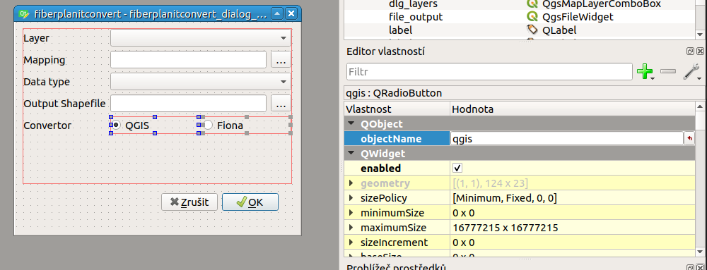

******************************************
Alternative version based on Fiona library
******************************************

`Fiona <https://fiona.readthedocs.io/en/latest/manual.html>`_ is vector data
library - Python layer on top of `GDAL (OGR) <https://gdal.org>`_.

It can be interesting, to create independent Python modules, which will solve
the geospatial issues out of the QGIS environment. Therefore, we are going to
present different approach of the same data transformation task.

.. note:: The code can be downloaded from https://github.com/GISMentors/yungo-plugins/tree/master/src/fiberplanitconvert-05-fiona

===========
Qt Designer
===========

We are going to add a new graphical element - radio button switcher to
choose between QGIS tools and Fiona for the data transformation.

.. task:: Create radiobutton group for QGIS or Fiona. Use :pyqt:`QRadioButton`
    for the two elements. Use `objectName` again for naming the two radio
    buttons.

    Select the two radiobuttons and right-click with mouse and create a new button
    group.

	   
========
The code
========

Selecting proper tool
---------------------

Checking, which radiobutton is checked, is quite easy:

.. literalinclude:: ../src/fiberplanitconvert-05-fiona/fiberplanitconvert.py
    :lines: 224-226

For further selection of proper tool:

.. literalinclude:: ../src/fiberplanitconvert-05-fiona/fiberplan/__init__.py
    :lines: 40-43

Attribute data types
--------------------

QGIS and Fiona do use different data type definition. We re-use our
`DATA_TYPES` structure and add definition to Fiona

.. literalinclude:: ../src/fiberplanitconvert-05-fiona/fiberplan/__init__.py
    :lines: 8-31

Fiona
-----
Fiona is Python library for reading and writing vector data. It internally
converts the data structures into GeoJSON data format.

.. code-block:: python

    import fiona

    with fiona.open("file.shp") as input_file:
        for feature in input_file:
            print(feature["properties"]["name"])
            print(feature["geometry"]["type"])

    # ...

    with fiona.open("out_file.shp", "w", crs="EPSG:4326",
                    driver="ESRI Shapefile", schema=schema) as out:
        out.writerecords(features)

In our scenario, we need to open input data source, convert the attributes
according to mapping file and save it to target data file.

Creating new data source
------------------------

For new data source `schema` has to be specified, where geometry type and
attribute types have to be set. The schema is a simple JSON structure:

.. code-block:: python

    schema = {
        'geometry': "Point",
        "properties": {
            "name": "str:25",
            "size": "int"
        }
    }

Reading data from CSV structure
-------------------------------

For CSV file manipulation `csv` python module can be used.

.. literalinclude:: ../src/fiberplanitconvert-05-fiona/fiberplan/fiona.py
    :lines: 8-33

Creating new feature
--------------------
As mentioned, Fiona uses GeoJSON structure for vector data manipulation.
Creating a new features can be straight-forward:

.. code-block:: python

    feature = {
        "properties": {
            "name": "Oto",
            "size": 20
        },
        "geometry": {
            "type": "Point",
            "coordinates": [15, 50]
        }
    }

.. task:: Create new ESRI Shapefile based on input CSV file and
    mapping file. After the file is created, use

    .. code-block:: python

        vl = QgsVectorLayer(file_name, layer_name, "ogr")
        QgsProject.instance().addMapLayer(vl)

    For adding newly created layer to current QGIS project.
