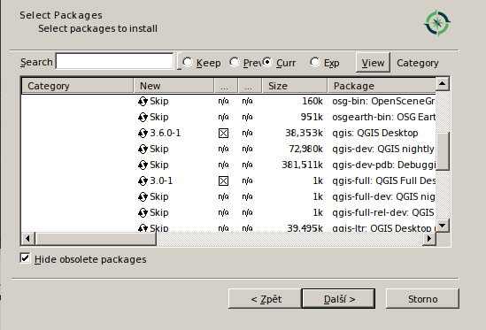

#####################
Instalace a nastavení
#####################

Než začneme pracovat na vývoji zásuvných modulů pro QGIS, je potřeba nastavit a
nainstalovat některé nástroje, které nám následně vývoj usnadní.

Textový editor
**************

Pokud chceme programovat, potřebujeme především textový editor. Ten nám umožní
psát zdrojový kód programu. Moderní textové editory se snaží programátorům práci
všelijak usnadnit: kontrolují správnost syntaxe, barevně zvýrazňují části kódu
pro lepší orientaci, pomáhají s formátováním textu (hlídají délku řádků,
odsazení bloků a podobně). Někteří programátoři preferují před relativně
jednoduchými ale univerzálními textovými editory tzv. integrovaná vývojová
prostředí (integrated development environemnt - IDE). Ty obsahují hlubší
integraci s programátorskými nástroji, kontrolu kódu v průběhu psaní,
automatické doplňování názvů funkcí, proměnných a tříd, a podobně.

Předpokldáme, že pokud jste se rozhodli začít programovat zásuvné moduly do
QGIS, máte už jasno v tom, v jakém prostředí budete kód psát. Pokud jste se alem
zatím nerozhodli, zvažte některou z následujících možností:

`Sublime <https://www.sublimetext.com/>`_
        Sublime je velice pokročilý textový editor, obsahující vše co
        programátor potřebuje pro psaná kódu. Jedna z jeho zvláštních vlastností
        je přehled o struktuře  (náhled) souboru v pravém sloupečku. Je
        rozšiřitelný o zásuvné moduly.

        Sublime není otevřený software, je ale volně k použití pro nekomerční
        účely.

`Atom <https://atom.io/>`_
        Atom text editor je open source alternativa k Sublime. Vizuálně se
        funkcím Sublime velice blíží a přebírá některé jeho funkce. Vzhledem k
        použité platformě, ve které je vyvíjen (JavaScript) se ale někdy stává,
        že u větších projektů se značně zpomalí práce s ním. V našem případě -
        psaní relativně jednoduchých modulů do QGIS - bychom ale na jeho limity
        neměli narazit.

`Microsoft Visual Studio Code <https://code.visualstudio.com/>`_
        Microsoft vydal svůj populární textový editor pro programátory pod
        otevřenou licencí. Jedná se o pokročilý a značně populární textový
        editor se zázemím velké firmy. Většina programátorů, kteří VSC začali
        používat si jej nemohou dostatečně vynachválit.

`PyCharm <https://www.jetbrains.com/pycharm/>`_
        PyCharm je integrované vývojové prostředí pro jazyk Python. Pokud
        plánujete strávit 90% svého programátorského času v Pythonu, určitě
        zvažte jeho nasazení. PyCharm není otevřený software, v základu jej však
        lze používat zadarmo. Na některých konferencích v České republice lze
        občas získat slevu na jeho nákup.

`Gedit <https://wiki.gnome.org/Apps/Gedit>`_
        Gedit je výchozí textový editor pro většinu linuxových distribucí, i
        když jsou dostupné binární balíčky i pro platformu MS Windows. Použím
        Gedit pro začátek nic nezkazíte, základní funkce obsahuje (i když je
        potřeba jej pro lepší práci trochu nastavit).

Jak vidíte, volba textového editoru může být složitá a není výjimkou, když
programátor stráví dlouhé dny pátráním po tom nejlepším. Každému vyhovuje něco
jiného - vzhledem k tomu, že prostředí textového editoru budete trávit 90% svého
pracovního času, stojí za to se výběrem vážně zabývat, stejně jako lze rozhodně
doporučit věnovat dostatek času na jeho naučení.

Určitě se vyhněte některé z následujících voleb pro psaní kódu v Pythonu:

`Notepad (poznámkový blok) <https://cs.wikipedia.org/wiki/Pozn%C3%A1mkov%C3%BD_blok>`_
        Základní textový editor ve Windows umí opravdu pouze to nejdůležitější:
        zadat text do souboru. Postrádá jinak prakticky vše, co vám
        programátorskou práci usnadní. Notepad použijte pouze v případě nejvyšší
        nouze - pro opravu kódu na systému, kde nemůžete nic instalovat.

`MS Office <https://products.office.com/cs-cz>`_ (a podobné)
        Textové processory nejsou textové editory. Textové procesory slouží k
        formátování vizuálně přijatelných dokumentů - ne pro psaní přehledného a
        strukturovaného kódu. Jejich vhodnost na programování můžeme přirovnat k
        použití motorové pily na porcování řízků pro nedělní oběd - může se to
        zdát jako dobrý nápad, výsledek je ale velice nepovedený řízek a
        znečistěná kuchyně. Textové procesory (a motorová pila) jsou určeny na
        zcela odlišný druh práce, než programování.

Pokud jste nadšenec do operačního systému Linux, můžete ještě zvážit některý z
nástrojů ze staré školy.

`Vim <https://www.vim.org/>`_
        Vim je jedním z  nejstarších textových editorů na platformě Unix, který
        je do dnešních dní aktivně vyvíjen. Jeho ovládání se může zdát na první
        pohled nelogické, je ovšem návykové do té míry, že přechod na jiný
        textový editor je prakticky nemožný. Vim je dostupný na prakticky každé
        instalaci některého z klonů operačního systému Unix, takže jeho základní
        znalost je potřebná pro drobné administrátorské zásahy. Pokud chete Vim
        vyzkoušet, určitě si k ruce vemte starší, ale stále aktulní, `český
        návod <http://www.it.cas.cz/manual/vim/index.htm>`_.

`GNU Emacs <https://www.gnu.org/software/emacs/>`_
        GNU Emacs je další "tradiční" textový editor používaný na Linuxu. Jeho
        ovládání je opět poněkud nezvyklé, ale pokud se jej jednou naučíte
        ovládat a pochopíte jeho filosofii, už na něj nedáte dopustit.

.. note:: Velká část textů školicích materiálů GISMentors vzniká v textových
        editorech Vim a Emacs - rozhodně se nejedná o archaické a nepoužívané
        programy.
        

****************************
Instalace QGIS na MS Windows
****************************

QGIS nainstalujte stejným způsobem, jak je popsáno v našem `kurzu pro
začátečníky <http://training.gismentors.eu/qgis-zacatecnik/instalace/windows.html#osgeo4w-instalator>`_

Při pokročilé volbě instalace zvolte balíčky `QGIS Desktop` a `QGIS Desktop
full`.

        
        Volba instalace balíčků pro QGIS na platformě MS Windows.

Nastavení prostředí
===================

Na platformě MS Windows je obvyklé, že si instalované programy nesou  vlastní
instalaci interpretu jazyka Python s sebou. Je dobré použít skript, který
provede nastavení prostředí a tím se usnadnil vývoj zásuvných modulů.

Následující kód nastaví pracovní cesty a cesty ke spustitelným souborům v
prostředí OSGeo4W a spustí příkazovou řádku Windows.

.. code-block:: bat

        @echo off
        SET OSGEO4W_ROOT=C:\OSGeo4W64
        call "%OSGEO4W_ROOT%"\bin\o4w_env.bat
        
        @echo off
        path %PATH%;%OSGEO4W_ROOT%\apps\qgis\bin
        path %PATH%;%OSGEO4W_ROOT%\apps\grass\grass-7.4.0\lib
        path %PATH%;C:\OSGeo4W64\apps\Qt5\bin
        path %PATH%;C:\OSGeo4W64\apps\Python36\Scripts
        
        set PYTHONPATH=%PYTHONPATH%;%OSGEO4W_ROOT%\apps\qgis\python
        set PYTHONHOME=%OSGEO4W_ROOT%\apps\Python36
        
        set PATH=C:\Program Files\Git\bin;%PATH%
        
        cmd.exe

.. note:: Upravte cesty k souborům tak, aby odpovídaly situaci na vašem
        operačním systému.

Soubor uložte do složky :file:`c:\OSGeo4W` a pojmenujte jej :file:`pyqgis.cmd`.

Klikněte na soubor 2x levým tlačítkem myši, a otevře se příkazová řádka windows.
V této příkazové řádce je vše nastavené tak, abychom mohli používat Python a
další nástroje spolu s QGIS.

V dalším kroce je nutné aktualizovat intstalátor `pip`, to zařídíme příkazem

.. code-block:: bash
                
   python3 -m pip install --upgrade pip

**********
Virtualenv
**********

Virtuální prostředí pro běh programů je jedna z možností, jak udržet navzájem
kompatibilní verze potřebných balíčků a nezatížit tím zbytek systému.

Pro běh QGIS v rámci virtualenv je potřeba do skriptu `postactivate` doplnit
např. následující obsah (obsah přizpůsobte vlastnímu systému):

.. code-block:: bash

        #!/bin/bash
        # This hook is sourced after this virtualenv is activated.

        export PYTHONPATH=$PYTHONPATH:/usr/local/share/qgis/python/:/usr/lib/python3/dist-packages/
