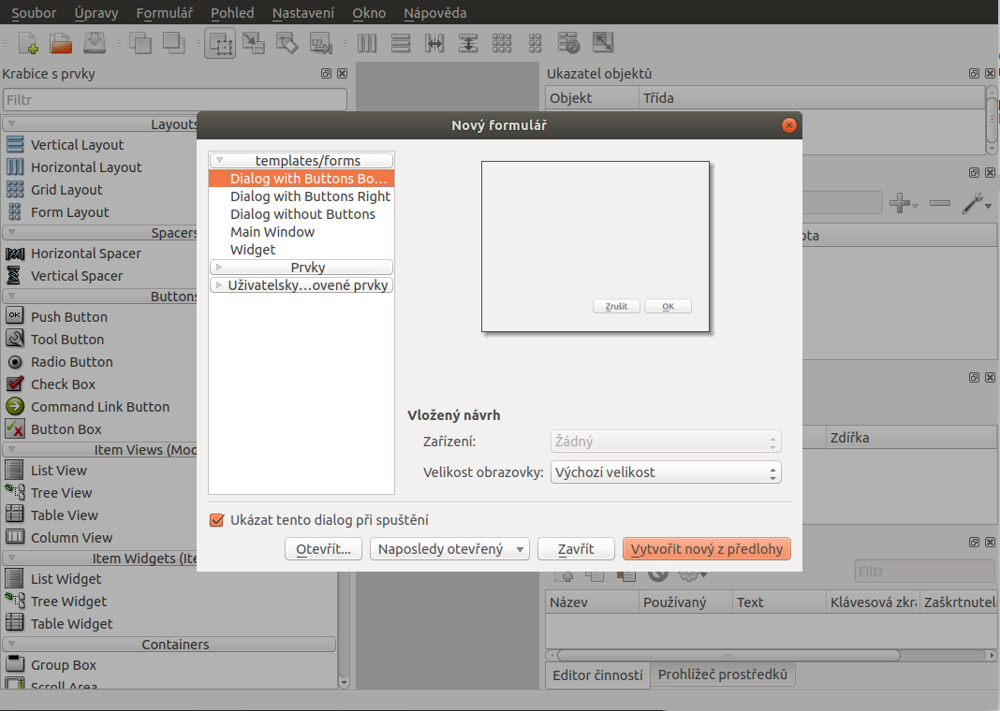
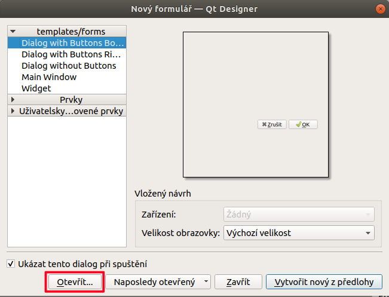
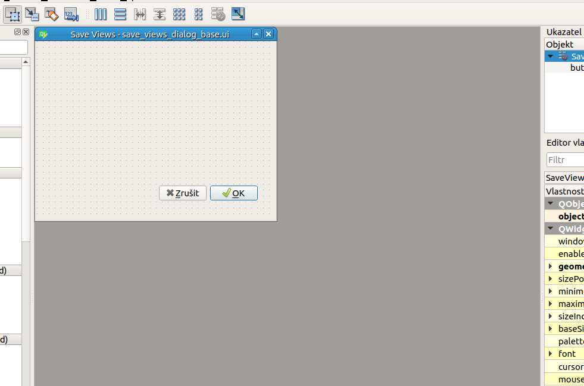

####################################
QtDesigner - vzhled zásuvného modulu
####################################

`QtDesigner <https://doc.qt.io/qt-5/qtdesigner-manual.html>`_ je nástroj pro
tvorbu grafického uživatelského rozhraní pomocí knihovny `Qt <https://www.qt.io/>`_.

QGIS (jak název napovídá) je vytvářen pomocí knihovny Qt - a stejně tak jsou i
jeho moduly. Abychom nemuseli psát veškerý kód nutný pro stavbu a uživení
grafických prvků, můžeme velkou část práce udělat "grafickéhoicky" právě v prostředí
QtDesigner.

        Logo programu QtDesigner

Po spuštění QtDesigner se objeví dialog pro tvorbu nového grafického formuláře.

        První spuštění QtDesigner

Klikněte na tlačítko :item:`Otevřít` a v dialogu výběru souborů se navigujte na soubor
:file:`save_views/save_views/save_views_dialog_base.ui` v našem projektu.

        Otevřít existujicí projekt

QtDesigner vykreslí náš projekt tak, jak je prozatím nakonfigurován po stránce
uživatelského rozhraní -  tedy pouze prázdný dialog s tlačítky :item:`Zrušit` a
:item:`OK`.

        Otevřít existujicí projekt

Pomocí QtDesigneru můžeme nyní vstupní dialog našeho zásuvného modulu nastavit
tak, aby obsahoval formulářová pole pro všechny potřebné vstupní hodnoty a
výstupní hodnoty. Grafické elementy lze umisťovat do `bloků` tak, aby byly
správně zarovnány. Jednotlivým prvkům lze také pomocí nástrojů v pravé části
přiřazovat akce a události a nastavovat která část kódu se má při dané akci
spustit.
