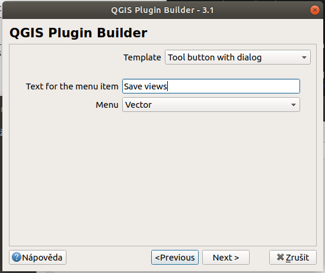

****************
Založení pluginu
****************

Založení pluginu provedeme nejjednodušeji pomocí pluginu QGIS Plugin Builder,
který spustíme buď z menu :menuselection:`Zásuvné moduly --> Plugin Builder` nebo
pomocí ikony |pluginBuilderIcon| z nástrojové lišty.

.. figure:: ../images/builder_init.png

        Spuštění QGIS Plugin Builder

Vyplníme potřebné hodnoty:

Class name
        Jméno hlavní třídy (pro jazyk Python) (obvykle začíná velkým písmenem a
        slova jsou naznačena také velkým posmenem)

Plugin name
        Jméno zásuvného modulu tak, jak bude viditelný pro uživatele - může
        obsahovat mezery a další znaky

Description
        Krátký popis

Module name
       Jméno modulu - zejména pak adresáře, do kterého bude modul uložený 

        Vyplnění vstupních hodnot

V dalším kroce je potřeba vyplnit delší popis pluginu a jeho funkce

        Nastavení položky `About` zásuvného modulu

V dalším kroku je potřeba nastavit šablonu zásuvného modulu. Na výběr máme ze
tří možností

1. :guilabel:`Tlačítko a dialog` - výchozí nastavení, které vytvoří tlačítko na liště QGIS a
   po jeho kliknutí se vykreslí vstupní dialogové okno pro zadání dalších hodnot
2. :guilabel:`Tlačítko a dock` - po aktivaci modulu se vykreslí dokovatelné
   okno, které lze začlenit do grafickéhé rozhranní QGIS (podobně jako přepínač
   vrstev, nástroj dotazování nebo třeba konzole Python).
3. Poskytovatel Processing nástrojů - speciální případ zásuvného modulu, který
   může být spouštěn jako další z komponent Processing zásuvného modulu.

Další volbou je pak možnost začlenit zásuvný modul do kterého z menu, výchozí je
:guilabel:`Pluginss` ale na výběr máme :guilabel:`Raster` :guilabel:`Vector` a
další.

        Volba šablony zásuvného modulu

V dalším kroku nám Plugin Builder nabízí tvorbu některých souborů s metadaty. V
tuto chvíli necháme zaškrtnuté všechny metasoubory.

.. figure:: ../images/builder_meta.png

        Volba vytvořených metadat k zásuvným modulům.

Jednotlivé soubory slouží k pozdějšímu nastavení

Internationalization
        Překlad zásuvného modulu do více jazyků
Help
        Nápověda pro zásuvný modul
Unit tests
        Testy pro modul
Helper scripts
        Pomocné skripty pro publikaci zásuvného modulu v repozitáři
        http://plugins.qgis.org a pro překlad a testování.
Makefile
        Makefile je konfigurační soubor pro automatizovaný build projektů
        prostřednictvím programu `make`.
pb_tool
        Vytvoří konfigurační soubor pro nástroj `pb_tool`, který pomáhá  se
        sestavením zásuvného modulu na různých operačních systémech.

        Doporučujeme používat právě `pb_tool` na místo výše zmíněného `make`

V dalším kroku je potřeba nastavit linky k nástroji pro správu chyb, repozitář
projektu a jeho domovskou stránku. V této fázi projektu zatím nemáme ani jedno,
nicméně je dobrým zvykem tyto linky nastavit a  udržovat aktuální.

        Linky vedoucí na repozitář a hlášení chyb pluginu

V posledním kroku zvolíme cílový adresář, kam bude zásuvný  modul uložen.
Není důležité, aby byl uložen do cílového adresáře se zásuvnými moduly - naopak,
uložte jej mezi své další vývojové projekty.

        Nastavení cílové cesty nového zásuvného modulu.

Po kliknutí na tlačítko :guilabel:`Generate` je  plugin vytvořen.

.. figure:: ../images/builder_report.png

        Finální report o tvorbě zásuvného modulu

V tuto chvíli byl vytvořen adresář se zásuvným modulem a minimální sadou souborů
potřebnou pro jeho běh:

`help`
        Adresář se soubory pro dokumentaci zásuvného modulu
`i18n`
        Adresář se soubory pro jazykové mutace zásuvného modulu
`scripts`
        Pomocné skripty potřebné pro překlad a další
`tests`
        Prostředí pro tvorbu a běh automatizovaných testů
`icon.png`
        Ikona, která bude použita v QGIS
`__init__.py`
        Python modul
`Makefile`
        Skript pro automatizování sestavení zásuvného modulu. Je východnější
        používat nástroj `pb_tool`
`metadata.txt`
        Soubor se základními informacemi o zásuvném modulu, jeho autorech, linky
        na správu bugů, a další
`pb_tool.cfg`
        Konfigurační soubor skriptu `pb_tool`. Doporučuje se používat tento
        nástroj na rozdíl od staršího `make`
`plugin_upload.py`
        Skript pro automatický upload zásuvného modulu na server
        `plugins.qgis.org`
`pylintrc`
        Konfigurační soubor pro statickou kontrolu zdrojového kódu nástrojem
        `pylint`
`README.*`
        Soubory se základními informacemi o projektu
`resources.*`
        Ikony a obrázky potřebné pro vykreslení zásuvného modulu při jeho
        inicializaci.
`save_views_dialog_base.ui`
        Konfigurace živatelského rozhraní
`save_views_dialog.py`
        Python skript pro inicializaci dialogového okna
`save_views.py`
        Základní skript zásuvného modulu

###################
Konfigurace pb_tool
###################

Pro použití nástroje `pb_tool`, je potřeba nejprve upravit soubor `pb_tool.cfg`:

Můžeme upravit některé proměnné, například hodnotu `plugin_path` a nastavit cílovou cestu
pro uložení zásuvného modulu do QGISu.

Pokud máme některé další důležité soubory pro distribuci, mohou zde být
nakonfigurovány.

###############
Nasazení modulu
###############

Zásuvný modul nasadíme do QGISu příkazem

.. code-block:: bash
        
        pb_tool deploy

Následuje informační text o tom, jak bude probíhat nasazení. Je dobré
zkontrolovat cílovou cestu - a následně potvrdit `y`.

.. code-block:: bash

        (qgis3plugins) ~/.../save_views$ pb_tool deploy
        Deploying to /home/user/.local/share/QGIS/QGIS3/profiles/default/python/plugins/save_views
        Deploying will:
                * Remove your currently deployed version
                * Compile the ui and resource files
                * Build the help docs
                * Copy everything to your /home/user/.local/share/QGIS/QGIS3/profiles/default/python/plugins/save_views directory

        Proceed? [y/N]: y

Nástroj `pb_tool` nás informuje o průběhu nasazování. Po jeho skončení můžeme
v QGIS zásuvný modul aktivovat - je ovšem nutné nejprve restartovat QGIS.

Ve správě zásuvných modulů můžeme náš modul `SaveView` aktivovat

        Aktivace zásuvného modulu

Modul můžeme následně spustit z lišty, mělo by se nám ukázat prázdné dialogové
okno.

        První spuštění zásuvného modulu

