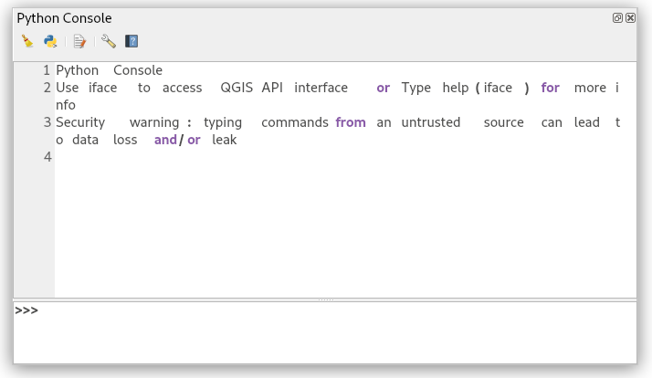
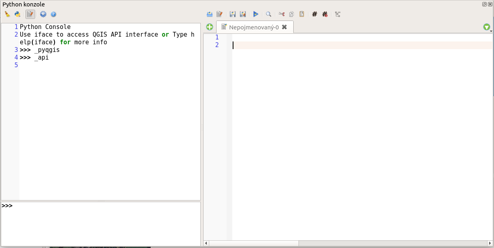

.. |clearConsole| image:: ../images/icon/iconClearConsole.png
   :width: 1.5em

.. |runConsole| image:: ../images/icon/iconRunConsole.png
   :width: 1.5em
.. |showEditorConsole| image:: ../images/icon/iconShowEditorConsole.png
   :width: 1.5em

====================
Interaktivní konzole
====================

Ať už na MS Windows nebo na systému Linux, měli byste mít v tuto chvíli
`nainstalovaný QGIS
<http://training.gismentors.eu/qgis-zacatecnik/instalace/index.html>`_ a v něm
si můžeme spustit consoli Pythonu a zjistit verzi systému.

:menuselection:`Zásuvné moduly --> Python konzole` (:kbd:`Ctrl+Alt+P`). Otevře se nové okno, ve
kterém můžeme rovnou začát používat aplikacení rozhraní QGIS.

    Spuštění Python konzole

Interaktivní konzole obsahuje v záhlaví v panelu nástrojů následující funkce:

|clearConsole|
    Vyčistí obsah okna, smaže veškerý zobrazený text
|runConsole|
    Spustí zadaný příkaz, alternativně můžete prostě stisknout klávesu
    :kbd:`Enter`
|showEditorConsole|
    Spustí editor programového kódu
|settingsConsole|
    Spustí podrobnější nastavení konzole a editoru
|helpConsole|
    Spustí nápovědu pro konzoli v okně webového prohlížeče

.. todo:: Popis |classConsole| - platný pouze pro 3.0.2/master

Konzole nám umožní psát interkativně kód, bude nám přehledně obarvovat syntaxi,
umožní nám napsaný kód uložit do externího souboru, zpřístupní nám rychle
nápovědu. Stisknutím :kbd:`Ctrl-Alt-Mezera` nám bude automaticky doplňovat
příkazy a :kbd:`Ctrl-Shift-Mezera` zpřístupní jejich histori.

Napsáním příkazu 

.. code-block:: python

    >>> _pyqgis

Se zobrazí dokumentace k použití Pythonu v QGIS.

.. code-block:: python

    >>> _api

Zobrazí dokumentaci k aplikačnímu rozhraní QGIS.

Editor
------

Vestavěný editor kódu spustíte kliknutím na ikonu |showEditorConsole|. Při psaní
programu může být užitečná funkce automatického doplňování (:kbd:`Ctrl+Mezera`),
kontrola syntaxe (:kbd:`Ctrl+4`), vyhledávání v kódu a inspektor kódu.

    Vestavěný editor kódu
