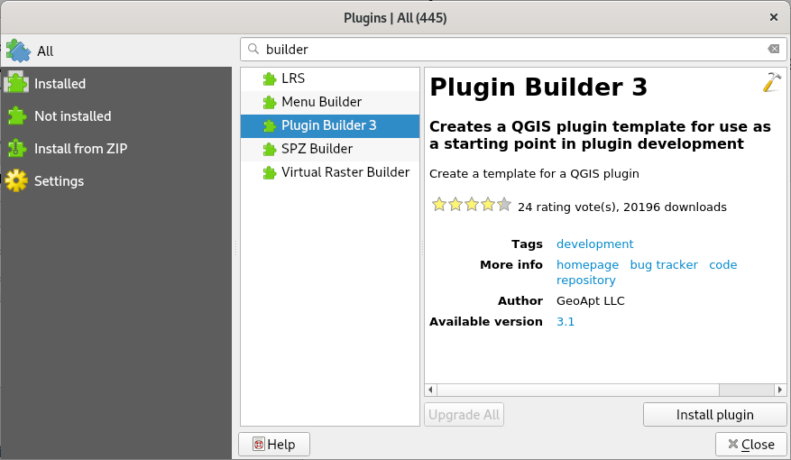

##########
Setup QGIS
##########

Two helper plugins need to be installed:

#. Go to :menuselection:`Plugins --> Manage and Install Plugins...`
   and enable ``Show also experimental plugins`` in ``Settings`` tab
#. Search for ``Plugin Builder 3`` and install the plugin
#. Search for ``Plugin Reloader`` and install the plugin

   Install Plugin Builder 3.

