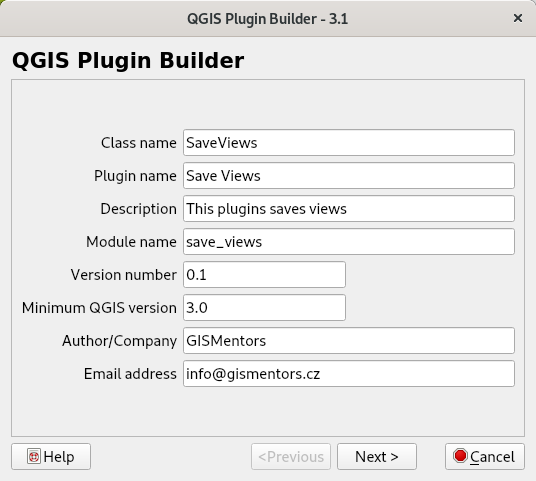
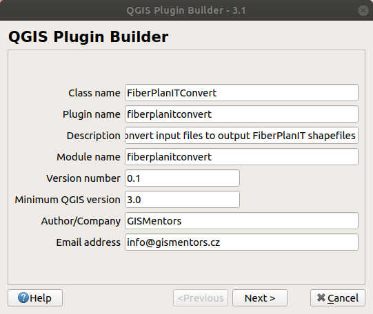
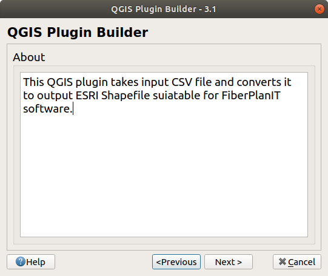
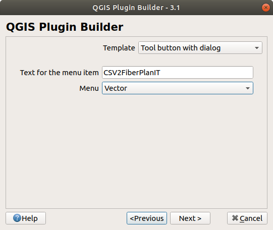
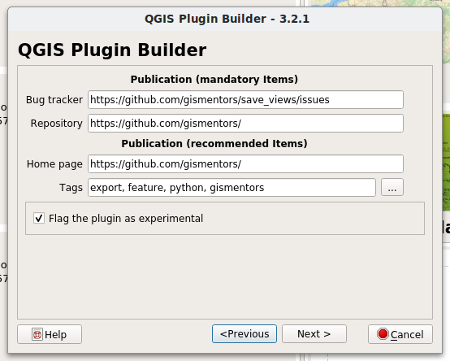
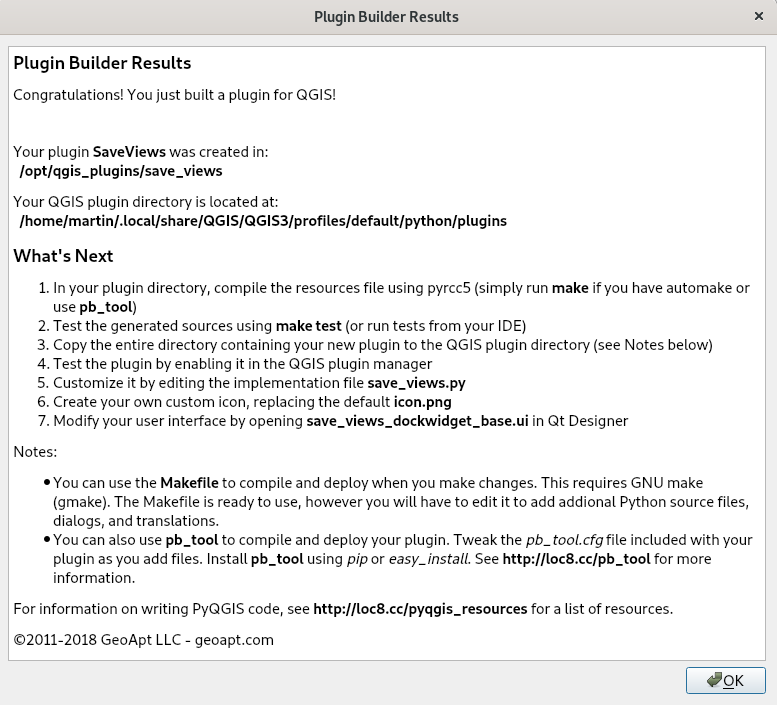
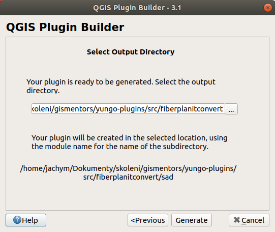

#################
Start QGIS Plugin
#################

Start the ``Plugin Builder`` plugin and fill necessary inputs. In the first step,
we are going to fill the names for Python classes and module names.

        Initialization of new QGIS Plugin

.. note:: Don't use ``.py`` (or any extensions) in the names.
          
In the next screen, fill longer description of the plugin.

   Filling longer description text

In the next screen, set visual appearance of the plugin. We will use 
`Tool button with dock widget`.

   Choosing visual representation of new plugin
   
There ware three possibilities of the dialog:

* Tool button with dialog
* Tool button with dockwidget
* Processing provider (see `QGIS Advanced course <http://training.gismentors.eu/qgis-pokrocily/geoprocessing/index.html>`_)

In the next step, we shell check all the metafiles, the builder will
generate for us. We shall leave all checked.

   Helper scripts to be generated.

..
  .. figure:: images/plugin_builder4.png

        Picking required metafiles

In the next step you need to fill important URLs. It is good to fill the URLs
for later publications.

        Filling required URLs

In the last step, we pick the location of the new created plugin. You can pick any
location in your computer.

        Filling required URLs

.. note:: On Microsoft Windows at this point, you may see error message about
   :program:`pyrcc5` script not being available in your system and therefore it
   could not be compiled. Do not panic, we will compile the plugin manually later with
   environment set up.

   .. figure:: images/pyrcc5-error.png
      :class: medium
        
Final screen shows summary of the new plugin and QGIS environment settings as
well as the next required steps.

        Plugin summary

Important information are:

#. Location of the new created plugin
#. Default location of all QGIS plugins
#. *Implementation* file is called :file:`save_views.py`
#. GUI modification shall happen in Qt Designer using the
   :file:`save_views_dialog_base.ui` file
#. Next step is to use `pb_tool` for the plugin management

There is also information about folders, where QGIS is looking for
installed plugins. On Linux, this typically is
:file:`$HOME/.local/share/QGIS/QGIS3/profiles/default/python/plugins`.
Windows it may be
:file:`%APPDATA%\\Roaming\\QGIS\\QGIS3\\profiles\\default\\python\\plugins`.
