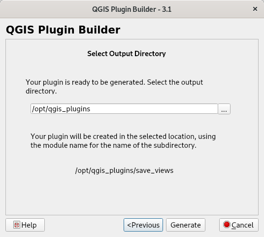

#################
Start QGIS Plugin
#################

Start the ``Plugin Builder`` plugin and fill necessary inputs. In the first step,
we are going to fill the names for Python classes and module names.

.. figure:: images/plugin_builder1.png

        Initialization of new QGIS Plugin

In the next screen, fill longer description of the plugin.

.. figure:: images/plugin_builder2.png

        Filling longer description text

In the next screen, set visual appearance of the plugin. We will use standard
`Tool button with dialog`.

.. figure:: images/plugin_builder3.png

        Choosing visual representation of new plugin

On the next step, we shell check all the metafiles, the builder will generate
for us. We shall leave all checked.

        Picking required metafiles

In the next step you need to fill important URLs. It is good to fill the URLs
for later publications.

        Filling required URLs

In the last step, we pick the location of the new created plugin. You can pick any
location in your computer.

.. figure:: images/plugin_builder7.png

        Filling required URLs
        
Final screen shows summary of the new plugin and QGIS environment settings as
well as the next required steps.

.. figure:: images/plugin_builder6.png

        Plugin summary

Important informations are:

#. Location of the new created plugin
#. Default location of all QGIS plugins
#. *Implementation* file is called :file:`fiberplanitconvert.py`
#. GUI modification shall happen in Qt Designer using the
   :file:`fiberplanitconvert_dialog_base.ui` file
#. Next step is to use `pb_tool` for the plugin managemnt
