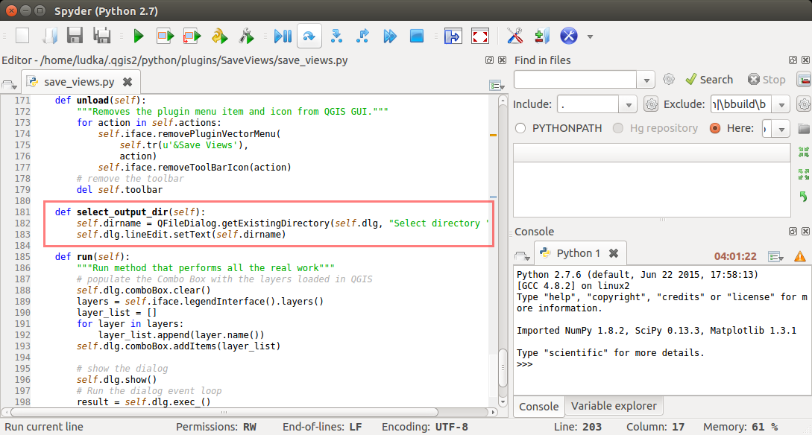

.. |box_yes| image:: ../qgis/images/checkbox.png
   :width: 1.5em
.. |npicon| image:: ../qgis/images/np_plugin_icon.png
   :width: 1.5em
.. |plugin-builder| image:: ../qgis/images/plugin-builder-icon.png
   :width: 1.5em
.. |plugin-reloader| image:: ../qgis/images/plugin-reloader-icon.png
   :width: 1.5em

Save Views
==========

.. todo:: Rewrite to English
          
1. Vytvoření šablony nového pluginu
-----------------------------------

Po spuštění zásuvného modulu pro tvorbu pluginů |plugin-builder| se
objeví dialogové okno, kde zadáme základní údaje o našem novém
nástroji, viz. :numref:`plugin-builder`.

.. _plugin-builder:

.. figure:: images/plugin-builder-0.png
   :class: small

   Dialogové okno zásuvného modulu na tvorbu pluginů. Zde vyplníme
   základní udáje.

.. note:: *Class name* je název Python třídy a *Module name* název
   adresáře. U těchto položek nepoužívejte diakritiku, mezery a pod.

.. figure:: images/plugin-builder-1.png
   :class: small

   Na další stránce průvodce vyplníme podrobné informace o našem
   nástroji (*About*).

V třetí části vybereme šablonu uživatelského prostředí. K dispozici jsou tři:

* *Tool button with dialog* (samostatné okno)
* *Tool button with dockwidget* (přichytnutelné okno)
* *Processing provider* (poskytovatel pro nástoje zpracování, viz
  školení :skoleni:`QGIS pro pokročilé
  <qgis-pokrocily/geoprocessing/index.html>`)

.. figure:: images/plugin-builder-2.png
   :class: small

   V našem případě zvolíme `Tool button with dockwidget`.

Zadáme text, který se bude zobrazovat v menu. Nakonec vybereme, pod
kterou položkou v menu náš nový plugin uživatel najde.

   
   Na dalších stránce průvodce je možné ovlivnit vytvoření dalších
   podpůrných souborů (lokalizace, nápověda, ...).

.. figure:: images/plugin-builder-4.png
   :class: small

   Dále je možné vyplnit povinné a volitelné informace, například
   domovskou stránku, repositář modulu se zdrojovými kódy, označit
   nástroj jako experimentální a podobně. Tyto udaje lze doplnit ale
   později. Ponecháme prozatím výchozí hodnoty.

Následně se objeví okno, kde je potřebné zadat cestu, ve kterém se
adresář s vytvořeným pluginem vytvoří. Zvolíme vhodné umístění na
vašem disku, v našem případě :file:`/opt/qgis_plugins`.

   Cílový adresář, kde se vytvoří šablona s pluginem.

Po tomto kroku se objeví potvrzující dialog, tzv. `Plugin Builder
Results` obsahující souhrnné informace.

.. figure:: images/plugin-builder-6.png
   :class: small

   Souhrné informace o vytvořeném pluginu.

.. _plugin_dir:

Na tomto místě najdete jednu podstatnou informaci, a to cestu k
adresáři, kde vaše instalace QGISu hledá při načítání zásuvné
moduly. Tato cesta je závislá na platfomě. Pod Linuxem je to typicky
:file:`$HOME/.local/share/QGIS/QGIS3/profiles/default/python/plugins`. Pod
Windows
:file:`%APPDATA%\\Roaming\\QGIS\\QGIS3\\profiles\\default\\python\\plugins`.

.. _krok2:

2. Překlad qrc souboru
----------------------

.. important:: Tento krok provede Plugin Builder automaticky, pokud je
   v systémové cestě dostupný nástroj ``pyrcc5``.

Otevřte adresář s vytvořeným pluginem, v našem případě
:file:`/opt/qgis_plugins/save_views`. Pokud se soubor
:file:`resources.py` nevytvořil, je potřeba to napravit. Spustíme z
příkazové konzole příkaz ``make``. Ten vytvoří na základě *Resource
Collection File* (`*.qrc`) jeho Python přepis. Jde vlastně o spuštění
výše uvedeného ``pyrcc5``.

   
.. _krok3:

3. Načtení nového pluginu ve správci zásuvných modulů
-----------------------------------------------------

K tomu, aby nový plugin QGIS po startu našel, existuje více
možností. Nejjednoduší variantou je adresář s pluginem překopírovat do
výchozí cesty zásuvných modulů, viz :ref:`Krok 1 <plugin_dir>`. Lepší
variantou je definovat v nastavení QGISu (:menuselection:`Nastavení
--> Možnosti --> Systém`) proměnnou prostředí ``QGIS_PLUGINPATH``
ukazující na nadřazený adresář vašeho pluginu,
tj. :file:`/opt/qgis_plugins`. Po *restartu* bude QGIS zobrazovat
všechny pluginy, které do tohoto adresáře v budnoucnu umístíte.

.. figure:: images/qgis-pluginpath.svg
   
   Nastavení proměnné prostředí ``QGIS_PLUGINPATH``.

Po opětovném startu QGISu by měl být v sekci :menuselection:`Zásuvné
moduly --> Spravovat a instalovat zásuvné moduly` viditelný i plugin
*Save Views*. Zaškrtnutím |box_yes| se objeví jeho ikona |npicon| a
nová položka v hlavním menu, tak jako jsme zadali, tj. v sekci
:menuselection:`Zásuvné moduly --> Save Views`.

.. figure:: images/save-views-enable.png

   Aktivace zásuvného modulu Save Views.

Spuštěním |npicon| otevřeme dialog nástroje, který obsahuje popisek
(:numref:`plugin-dlg`).

.. _plugin-dlg:

.. figure:: images/plugin-ui-template.png
   :class: small

   Okno modulu *Save Views* po prvním spuštění.

.. tip:: V této fázi je dobré se zamyslet nad funkcionalitou pluginu,
   jaký bude typ vstupních dat a podobně. Na základě našich požadavků je
   vhodné si vytvořit testovací sadu.

   Vytvoříme si jednoduchý projekt v QGISu, který bude obsahovat několik
   vektorových vrstev. Na :numref:`np-project` jsou zobrazeny například
   požární stanice, železnice, kraje, velkoplošné území a státní
   hranice České republiky.

   .. _np-project:

   .. figure:: images/qgis-project.png
      :class: middle

      Příklad projektu s vektorovými vrstvami v QGIS.

.. _krok4:

4. Vytvoření uživatelského rozhraní pomocí Qt Designer
------------------------------------------------------

Vzhled a elementy dialogového okna pluginu budeme upravovat v programu
*Qt Designer*. V hlavní liště zvolíme :menuselection:`File --> Open
File or Project` a otevřeme soubor s příponou `*.ui`. V našem případě
`save_views_dockwidget_base.ui`, který najdeme v adresáři vytvořeného
pluginu. Na :numref:`qtcreator` je znázorněné prozatím prázdné okno
(`SaveViewsDockWidgetBase`) s objekty (tzv. widgety)
`dockWidgetContets` a `label`. Pomocí metody *drag-and-drop* je možné
z levého panelu přidávat další objekty a jejich názvy a vlastnosti
měnit v pravé části okna aplikace *Qt Designer*.

.. _qtcreator:

   Dialogové okno vytvářeného pluginu v prostředí aplikace *Qt Designer*.

Nejrpve v pravém panelu změníme předvolený text objektu `label` na
``Select a layer`` (:numref:`qtlabel`).

.. _qtlabel:

.. figure:: images/qt-label.svg
   :class: middle

   Editace objektů dialogového okna.

Dále v levé části okna najdeme objekt typu *Combo Box* a tažením myši
jej umistíme do vhodného místa okna zásuvného modulu.

   Přidání nového widgetu typu Combo Box.

.. tip:: Pro reálný vývoj je vhodné výchozí názvy objektů (v našem
   případě *label* a *comboBox*) nastavit na hodnoty odpovídajícím
   reálnému využití, např.místo *combobox* *layerSelect* a pod.
   
Po uložení :menuselection:`File --> Save` přejdeme do prostředí QGIS,
kde použijeme plugin *Plugin Reloader* |plugin-reloader|. V `Choose a
plugin to be reloaded` nastavíme `SaveViews`
(:numref:`qt-plugin-reloader`) a plugin spustíme. Tím se aktualizuje
podoba našeho pluginu.

.. _qt-plugin-reloader:

   Konfigurace zásuvného modulu *Plugin Reloader*.

Po kliknutí na ikonu |npicon| se otevře okno odpovídající návrhu na
:numref:`qtlabel`.

.. figure:: images/plugin-ui-combo.png
   :class: small

   Okno modulu *Save Views* po úpravě uživatelského rozhraní.

.. _krok5:

5. Implementace funkcionality nástroje a další úpravy
-----------------------------------------------------

Řekněme, že chceme, aby se po spuštění pluginu *Combo Box* automaticky
naplnil vektorovými vrstvami aktuálního projektu. Hlavním souborem,
který se stará o logiku jednotlivých objektů, je v našem případě
:file:`save_views.py`. Otevřeme jej v textovém editoru a najdeme
metodu ``run()``. Tato metoda se spouští při každém startu pluginu. Na
její konec umístíme následující kód (:numref:`np-run-method`).

.. code:: python

	# populate the Combo Box with the vector layers loaded in QGIS
        from qgis.core import QgsProject, QgsMapLayer
        self.dockwidget.comboBox.clear()
        for layer in QgsProject.instance().mapLayers().values():
            if layer.type() != QgsMapLayer.VectorLayer:
                continue
            self.dockwidget.comboBox.addItem(layer.name())

.. _np-run-method:

.. figure:: images/run-method.svg
   :class: middle

   Úprava zdrojového kódu s cílem naplnit *Combo Box* vektorovými
   vrstvami.

Po znovu načtení pluginu |plugin-reloader| a jeho otevření |npicon| je
vidět, že se změny úspěšně projevily (:numref:`np-cb-filled`).

.. _np-cb-filled:

.. figure:: images/vector-select.png
   :class: small

   Vzhled dialogového okna po změnách ve zdrojovém kódu.

.. note:: V případě, že skončí spustění či znovunačtení chybou, tak
   hledejte relevatní informace ve *Zprávách výpisů*, konkrétně v
   záložce *Python chyba*.

   .. figure:: images/python-errors.png
      :class: middle

.. tip:: Namísto obecného objektu *Combo Box* by bylo možné použít
   specifický widget QGISu, a to ``QgsMapLayerComboBox``. Využití
   tohoto specifického widgetu by nám ušetřilo pár řádek kódu.

   .. todo:: doplnit nazev tridy
             
.. task:: Seznam vrstev se načítá pouze při spuštění pluginu. Upravte
   zdrojový kód tak, aby umožňoval znovunačtení seznamu vrstev i během
   běhu pluginu.

Obdobně vložíme do okna další elementy a přiřadíme jim příslušnou
funkcionalitu. Kromě popisu ``Select output directory`` půjde o
objekty `Line Edit`, `Tool Button`, `Push Button`.  U widgetu
`pushButton` ve vlastnostech změníme `text` na ``Save All``. Nastavíme
přiměřené rozměry pro každý element a upravený soubor uložíme.
Důležité jsou názvy jednotlivých objektů, viz. :numref:`np-final-dlg`,
budeme je ještě potřebovat.

.. _np-final-dlg:

.. figure:: images/plugin-ui-final.svg
   :class: middle

   Finální návrh uživatelského rozhraní pluginu *Save Views*.

.. note:: Pokud je uživatelské rozhraní definováno více objekty
	  (widgety) je vhodné je rozumně pojmenovat. V případě našeho
	  jednoduchého modulu si vystačíme s předvolenými názvy.

V dalším kroku potřebujeme přidat kód, který zabezpečí, aby se po
kliknutí na tlačítko ``...`` otevřel dialog, ve kterém zvolíme adresář
pro uložení výsledných obrazových souborů pro každý prvek ve vybrané
vektorové vrstvě. O tuto funkcionalitu se postará nová metoda
``select_output_directory()``, kterou přidáme na konec souboru
:file:`save_views.py`, :numref:`select-output-dir`.

.. code::

	# open directory browser and populate the line edit widget 
    	def select_output_dir(self):
            from PyQt5.QtWidgets import QFileDialog
	    self.dirname = QFileDialog.getExistingDirectory(
                self.dockwidget, "Select directory ", os.path.expanduser("~")
            )
            self.dockwidget.lineEdit.setText(self.dirname)

.. tip:: ``os.path.expanduser("~")`` nastaví cestu při otevření
   dialogu na domovský adresář.

.. note:: Kód importující použité třídy jako např. ``from
   PyQt5.Widgets import QFileDialog`` je vhodnější umístit na začátek
   souboru. Zde uvádíme především pro přehlednost úprav.

.. _select-output-dir:

   Metoda, která otevře dialog pro výběr výstupního adresáře.

.. task:: Upravte zdrojový kód tak, aby si dialog pamatoval poslední
   použitý adresář.
          
Následně propojíme metodu ``select_output_dir()`` s tlačítkem
``toolButton`` (tlačítko ``...``). To provedeme přidáním níže
uvedených řádků do metody ``__run__()``, nejlépe na konec těla
podmínky ``if self.dockwidget == None``, viz
:numref:`select-output-dir`.

.. code:: python

	# connect the select_output_file() method to the clicked signal of the tool button widget
        self.dockwidget.toolButton.clicked.connect(self.select_output_dir)

Na konec metody ``__run__()`` ještě přidáme kód zajišťující obnovení
prázdného obsahu objektu ``lineEdit``.

.. code:: python

	# clear the previously loaded text (if any) in the line edit widget 
        self.dockwidget.lineEdit.clear()

   Úpravy v kódu zajišťující propojení metody ``select_output_dir()``
   a tlačítka ``...``.
   
Soubor uložíme, plugin znovu načteme a vyzkoušíme
(:numref:`np-skuska-1`).
   
.. _np-skuska-1:

.. figure:: images/plugin-test-1.png
   :class: small

   Načtení adresáře pro grafické výstupy pomocí nového pluginu.

Posledním krokem je změnit to, aby se po kliknutí na tlačítko ``Save
all`` opravdu provedlo, co chceme. Vytvoříme novou metodu
``save_views()``, kterou umístíme na konec souboru
:file:`save_views.py`, viz :numref:`np-run-code`.

.. code::

       def save_views(self):
            from PyQt5.QtGui import QColor, QPixmap
            from qgis.core import QgsProject
            from qgis.utils import iface
            
            # save graphical output for every row in attribute table
            layer_name = self.dockwidget.comboBox.currentText()
            layer = QgsProject.instance().mapLayersByName(layer_name)[0]

            for feature in layer.getFeatures():
                layer.selectByIds([feature.id()])
                self.iface.mapCanvas().setSelectionColor(QColor("transparent"));
                box = layer.boundingBoxOfSelected()
                self.iface.mapCanvas().setExtent(box)
                pixmap = QPixmap(self.iface.mapCanvas().mapSettings().outputSize().width(),
                                 self.iface.mapCanvas().mapSettings().outputSize().height()
                )
                mapfile = os.path.join(self.dirname, '{0}_{1:03d}.png'.format(layer_name, feature.id()))
                self.iface.mapCanvas().saveAsImage(mapfile, pixmap)
                layer.removeSelection()
            
            # save also full extend of vector layer                            
            canvas = self.iface.mapCanvas()
            canvas.setExtent(layer.extent())
            pixmap = QPixmap(self.iface.mapCanvas().mapSettings().outputSize().width(),
                             self.iface.mapCanvas().mapSettings().outputSize().height()
            )
            mapfile = os.path.join(self.dirname, '{}_full.png'.format(layer_name))
            self.iface.mapCanvas().saveAsImage(mapfile, pixmap) 

Tuto metodu provážeme s tlačítkem ``Save all``.

.. code:: python

	# connect the save_views() method to the clicked signal of the push button widget
        self.dockwidget.pushButton.clicked.connect(self.save_views)

.. _np-run-code:

   Doplnění kódu do metody *run()*.

.. task:: Opravte chybu, která nastane po stisknutí tlačítka ``Save
   all`` v případě, že není nastaven adresář pro výstupní soubory.

.. task:: Upravte kód tak, aby mohl zadat uživatel výstupní adresář
          ručně bez tlačítka ``...``.
   
Grafické výstupy po aplikovaní na vrstvu krajů jsou zobrazeny na
:numref:`np-plugin-result`. Jejich názvy v adresáři závisí na názvu
konkrétní vektorové vrstvy. Liší se pouze pořadovým číslem. 

.. _np-plugin-result:

.. figure:: images/save-views-result.png
   :class: large

   Grafické soubory uložené ve zvoleném adresáři pro vektorovou vrstvu
   krajů České republiky.

.. tip::

   V případě, že chceme změnit ikonu, stačí nový soubor s ikonkou,
   např.  :numref:`np-new-icon`, uložit do adresáře :file:`save_views`
   jako soubor :file:`icon.png` a spustit příkaz ``make clean && make`` v
   příkazové řádce. Nakonec znovunačteme plugin pomocí modulu *Plugin
   Reloader*.

   .. _np-new-icon:

   .. figure:: images/np_new_icon.png
      :scale: 8%

      Příklad nové ikonky

Výsledný soubor ``save_views.py`` je ke stažení také `zde
<../_static/skripty/save_views.py>`__.
           
Jiný příklad využití
--------------------

Na obrázku :numref:`np-kn-project` je uveden projekt s katastrálními
daty. Vyznačené jsou parcely, přes které budou procházet plánované
inženýrské sítě.

.. _np-kn-project:

.. figure:: images/np_kn_project.png
   :class: middle

   Znázornění parcel přes které májí procházet plánované inženýrské
   sítě.

Použitím pluginu `Save Views` můžeme pro každého vlastníka vyhodnotit
grafické znázornění jeho parcely, na které bude zapsané věcné břemeno
(:numref:`np-kn-project-views`).

.. _np-kn-project-views:

.. figure:: images/np_kn_project_views.png
   :class: middle

   Pohled na každou parcelu jako výsledek zásuvného modulu *Save Views*.

